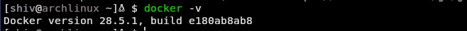
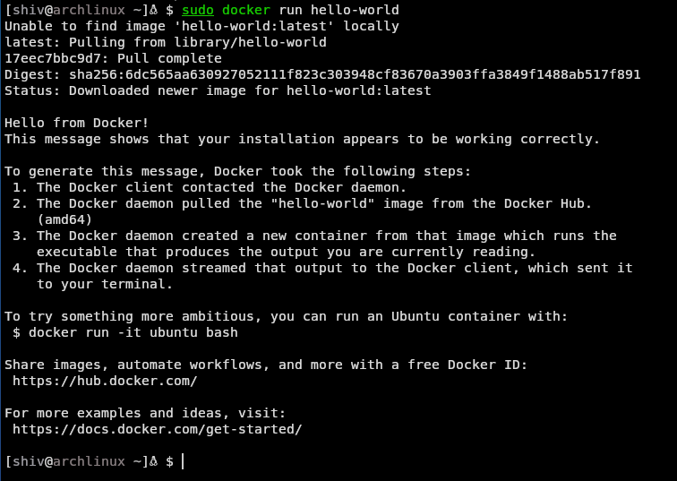

# Documentation

## SDLC
 - Software Developemnt Life Cycle are the steps that are followed while designing and developing high end Application Softwares.
 - Stages of SDLC :
  - Planning and Selection of Methodoligies
  - Development
  - Deployment
  - Testing 
  - Staging
  - Production

## Monolithic vs Microservices architecture
### Comparison Table

| Feature | Monolithic Architecture | Microservices Architecture |
|---|---|---|
| **Structure** | A single, unified codebase and deployment unit. | A collection of small, independent services. |
| **Development** | Simpler to start as it's a single application. | More complex initially due to the distributed nature. |
| **Deployment** | The entire application is deployed as a single unit. | Services are deployed independently of each other. |
| **Scalability** | Scaling is done by replicating the entire application. | Individual services can be scaled independently. |
| **Technology Stack** | A single technology stack for the entire application. | Each service can use its own technology stack. |
| **Data Management** | Typically uses a single, centralized database. | Each service can have its own database. |
| **Fault Tolerance** | A failure in one component can bring down the entire application. | A failure in one service is isolated and doesn't necessarily affect others. |
| **Team Structure** | Large development teams working on a single codebase. | Smaller, independent teams focused on individual services. |
| **Complexity** | Becomes complex to manage and maintain as the application grows. | Complexity is managed by breaking down the application into smaller services. |
| **Speed** | Slower to adapt to new changes and technologies. | Faster to innovate and adopt new technologies. |
| **Example**| A small Note taking application with limited number of users. | A large & scalable Application like Youtube, Netflix, etc. | 

### Summary

 - **Monolithic architecture** is often a good choice for smaller, less complex applications where rapid initial development is a priority. However, as the application grows, it can become difficult to scale, maintain, and update.

 - **Microservices architecture** is well-suited for large, complex applications that require high scalability and flexibility. While it introduces more initial complexity, it allows for independent development, deployment, and scaling of services, which can lead to greater agility and resilience in the long run.

## Blue-Green deployment environment
- Blue-Green Deployment is a software release strategy that minimizes downtime and reduces the risk associated with deploying new versions of an application. This technique involves maintaining two identical, separate production environments, aptly named "Blue" and "Green."

- At any given time, only one of these environments is live and serving production traffic. For instance, if Blue is the current live environment, the new version of the application is deployed to the Green environment.

---

## Docker Documentation
### ***Introduction***

Docker is an open platform that is used for development, shipping and running of Applications. It enables user to build and develop application in a separate [Sandboxed environment]().
With Docker, you can manage your infrastructure in the same ways you manage your applications.
Docker significantly shortens the delay between [writing code](), [testing it]() and [deploying]() it in Production where each second counts.
Docker can package an application and its dependencies in a virtual container that can run on any Linux, Windows, or macOS computer.
Docker refers to these Sandboxed environments as conatiners.

#### What is a [Container](https://www.docker.com/resources/what-container/) ?

- A Container in terms of Docker is a lightweight, standalone, executable piece of Software that includes everything that is needed to run an Application such as code, runtime, system tools and libraries.
- As Containers are lightweight and contain everything that is needed to run the application, the host is not needed to need any external software besides docker to run the applicaiton.
- Containers are designed to run consistently across different computing environments, making them portable and efficient.
- Containers are isolated from each other and each bundle their own separate software.

### Installation of Docker on Arch Linux

#### 1. Update Your System

First, ensure system's package database is up-to-date. Open your terminal and run:
~~~
sudo pacman -Syyu
~~~
{: .language-bash}

#### 2. Install Docker

Install the **Docker** package from the official Arch repositories.
~~~
sudo pacman -S docker
~~~
{: .language-bash}

#### 3. Start and Enable the Docker Service

After installation, you need to start the Docker service and enable it to launch automatically on system boot.

* **Start the *docker.service* now:**
    ~~~
    sudo systemctl start docker.service
    ~~~
    {: .language-bash}

* **Enable the *docker.service* for startup:**
    ~~~
    sudo systemctl enable docker.service
    ~~~
    {: .language-bash}

#### 4. Add Your User to the Docker Group (Optional but Recommended)

To run `docker` commands without needing to type `sudo` every time, you must add your user to the `docker` group. This group is created automatically during the package installation.

Replace `your-username` with your actual username, or simply use the `$USER` variable.

~~~
sudo usermod -aG docker $USER
~~~
{: .language-bash}

**Important:** For this change to take effect, you must **log out and log back in**, or simply reboot your system.

#### 5. Verify the Installation

Verify the installation by running checking docker version using following command 
~~~
docker -v 
~~~
{: .language-bash}

You should now be able to see Docker Version as output in your terminal.

***Output***
- 

#### 6. Run Hello World 

After logging back in, you can verify that Docker is installed and running correctly by executing the classic "hello-world" container.

~~~
docker run hello-world
~~~
{: .language-bash}

The installation was successful, you will see a message beginning with "Hello from Docker!". You now have a fully functional Docker setup on your Arch Linux machine.

***Output***
- 

---

## Kubernetes Documentation

### What is [Kubernetes](https://cloud.google.com/kubernetes-engine)?

K8s is a portable, extensible, open-source platform for managing containerized workloads and services.

**Origin**
: The name "Kubernetes" is Greek for "helmsman" or "pilot," which is why the logo is a ship's steering wheel.

**Open Source**
: It was originally designed by Google and is now maintained by the CNCF.

**Technology**
: It is written in the Go programming language (Golang).

**Purpose**
: To automate the deployment, scaling, and management of containerized applications.

### Why [Kubernetes](https://cloud.google.com/kubernetes-engine)?

Docker is great for managing individual containers, but challenges arise when dealing with them at scale.

Common Problems with Docker at Scale:

* Manual management and maintenance
* Handling upgrades and migrations
* Autoscaling based on demand
* Avoiding downtime

K8s is a Container Management Tool designed to solve these problems. It helps with:

* Deploying
* Scheduling
* Scaling
* Load balancing
* Batch execution
* Rollbacks
* Monitoring

Other container orchestration tools include Docker Swarm and Apache Mesos.

## Kubernetes Features
{: #k8s-features}

Storage Orchestration
: Automatically mount storage systems.

Secret and Configuration Management
: Manage sensitive information like passwords and API keys.

Automatic Bin Packing
: Optimizes resource usage by placing containers based on their requirements.

Self-healing
: Restarts failed containers, replaces and reschedules containers when nodes die.

Automated Rollouts and Rollbacks
: Automates application updates and can revert to previous versions if something goes wrong.

Service Discovery and Load Balancing
: Exposes containers using DNS names or IP addresses and distributes network traffic.

---

## Kubernetes Architecture
{: .architecture-section}

A K8s cluster consists of a **Master Node** (the brain) and multiple **Worker Nodes** (the hands).

### Pods

- The **smallest deployable unit** in K8s. It acts as a wrapper for one or more containers that share resources like the network and storage.

### Master Node (Control Plane)

 - The Master Node manages the **state of the cluster**. Its main components are:

**Kube-API Server**
: - The entry point for all cluster management commands. It authenticates and validates requests before processing them.

**etcd**
: - A reliable key-value store that holds all cluster data and state.

**Kube Scheduler**
: - Watches for newly created pods and assigns them to a suitable Worker Node.

**Controller Manager**
: - Runs various controllers (like the Node Controller and Replication Controller) to maintain the desired state of the cluster.

### **Worker Nodes**

- Worker Nodes are the machines where the actual applications run. Their main components are:

**Kubelet**
: An **agent** that runs on each worker node. It communicates with the API server and ensures that containers are running and healthy.

**Kube Proxy**
: Manages network rules on nodes, enabling communication between pods.

**Container Runtime**
: The software responsible for running containers (e.g., Docker).

---

